<!-- =======================================================================
  ⚡ RANGANAYAKI KS — PROFESSIONAL TECH BLUE GITHUB PROFILE README
  Theme: Professional Sapphire & Deep Obsidian (#070a12 base, Navy #0c1322, Tech Blue #2563eb / #1d4ed8, Cyan #38bdf8)
  Designed for: ranganayaki-ks (GitHub)
======================================================================= -->

<div align="center">

<!-- 🌌 DOMAIN-FOCUSED WAVING HEADER BANNER (UNIQUE WAVE BOX) -->


<br/><br/>

<!-- 📸 PORTRAIT CARD (BIGGER SIZE, SHARP RECTANGULAR BOX — NO CURVES) -->
<a href="https://ranganayaki-portfolio.netlify.app/" target="_blank">
  
</a>

<br/><br/>

<!-- ⚡ ANIMATED NAME & DOMAIN DISPLAY (FADE-OUT ROTATING TYPING) -->
<a href="https://git.io/typing-svg">
  
</a>

<p align="center" style="font-family: 'Plus Jakarta Sans', -apple-system, sans-serif; font-size: 14.5px; color: #94a3b8; letter-spacing: 1.5px; margin-top: 4px; margin-bottom: 18px; text-transform: uppercase;">
  Architecting scalable enterprise platforms &bull; Crafting intuitive digital products
</p>

<!-- 🌐 OFFICIAL BRAND PROFILE BADGES (AUTHENTIC WHITE LINKEDIN ICON) -->
[](https://ranganayaki-portfolio.netlify.app/)
[](https://linkedin.com/in/ranganayaki-ks/)
[](https://leetcode.com/u/ranganayaki-ks/)
[](https://www.codechef.com/users/ranganayaki_15)
[](mailto:ranganayaki1512@gmail.com)
[](https://github.com/ranganayaki-ks)

<br/>

<!-- 🏷️ QUICK STATS BADGES (PROFESSIONAL BLUE + WHITE GRADUATION CAP ICON) -->
-172554?style=for-the-badge&logo=googlescholar&logoColor=white)


<br/>


</div>

---

## 👩‍💻 About Me


```javascript
const Ranganayaki = {
  role: "Full Stack & AI Developer",
  location: "India 🇮🇳",
  focus: [
    "AI Technology",
    "Website / Software Development"
  ],
  learning: [
    "AI Tools",
    "Prompt Engineering",
    "Advanced Scalable Web"
  ],
  techStack: {
    frontend: ["HTML/CSS", "Bootstrap", "JS"],
    backend: ["PHP", "Java", "Python"],
    database: ["MySQL", "Relational DBs"]
  }
}
```

> *"The right tools don't replace craft — they amplify your speed to ship."*  
> **— Modern Developer Mindset**

<br clear="both"/>

---

## 🛠️ Tech Stack & Arsenal

> *"The right tools don't replace craft — they amplify your speed to ship."*

### ⚡ AI & Vibecoding Toolkit


### 🎨 UI/UX & Design Suite


![Canva](https://img.shields.io/badge/Canva-4B5563?style=for-the-badge&logo=data:image/svg%2Bxml;base64,PHN2ZyByb2xlPSJpbWciIHZpZXdCb3g9IjAgMCAyNCAyNCIgeG1sbnM9Imh0dHA6Ly93d3cudzMub3JnLzIwMDAvc3ZnIj48dGl0bGU+Q2FudmE8L3RpdGxlPjxwYXRoIGQ9Ik0xMiAwQzUuMzczIDAgMCA1LjM3MyAwIDEyczUuMzczIDEyIDEyIDEyIDEyLTUuMzczIDEyLTEyUzE4LjYyNyAwIDEyIDB6TTYuOTYyIDcuNjhjLjc1NCAwIDEuMzM3LjU0OSAxLjQwNSAxLjIuMDY5LjU4My0uMTcxIDEuMDk3LS44MjIgMS40MDYtLjM0My4xNzEtLjQ4LjE3Mi0uNTQ5LjA2OS0uMDM0LS4wNjkgMC0uMTM3LjA2OS0uMjA2LjYxNy0uNTE0LjYxNy0uOTI2LjU0OC0xLjUwOC0uMDM0LS4zNzgtLjMwOC0uNjE4LS41ODMtLjYxOC0xLjIgMC0yLjkxNCAyLjY3NC0yLjY3NCA0LjYyOS4xMDMuNzU0LjU0OSAxLjY0NiAxLjUwOSAxLjY0Ni4zMDggMCAuNjUtLjEwMy45Ni0uMjQuNS0uMjY0Ljc5OS0uNDcgMS4wOTctLjgtLjA3My0uODg1LjcwNC0yLjA0NiAxLjg1MS0yLjA0Ni41MTUgMCAuOTI2LjIwNS45Ni41ODMuMDY4LjUxNC0uMzc3LjU4Mi0uNTE0LjU4MnMtLjM3OC0uMDM0LS4zNzgtLjE3Yy0uMDM0LS4xMzguMzA5LS4wNy4yNzUtLjM3OC0uMDM1LS4yMDYtLjI0LS4yNzQtLjQ0Ni0uMjc0LS43MiAwLTEuMTMxLjk5NC0xLjAyOSAxLjYxMS4wMzUuMjc1LjE3Mi41NDkuNDQ3LjU0OS4yMDUgMCAuNTE0LS4zMS42MTctLjc1NS4wNjgtLjMwOC4zNDMtLjUxNC41ODMtLjUxNC4xMDIgMCAuMTcuMDM0LjIwNS4xNzF2LjEzOGMtLjAzNC4xMzctLjEzNy41NDgtLjEwMi42NTEgMCAuMDY5LjAzNC4xNzEuMTcuMTcxLjA5MiAwIC40MzYtLjE4Ljc3Ny0uNDU5LjExNy0uNTkuMjUzLTEuMjk4LjI1My0xLjM1Ny4wMzQtLjI0LjEzNy0uNDguNjE3LS40OC4xMDMgMCAuMTcxLjAzNC4yMDUuMTcxdi4xMzhsLS4xMzYuNjE3Yy40NDUtLjU4MyAxLjA5Ny0uOTk0IDEuNTA4LS45OTQuMTcyIDAgLjMwOS4xMDIuMzA5LjI3NCAwIC4xMDMgMCAuMjc0LS4wNjkuNDQ2LS4xMzcuMzc3LS4zMDkuOTYtLjQxMiAxLjQ3NCAwIC4xMzcuMDM1LjI3NC4yMDcuMjc0LjE3MSAwIC42ODUtLjIwNiAxLjA5Ni0uNzU0bC4wMDctLjAwNGMtLjAwMi0uMDY4LS4wMDctLjEzNC0uMDA3LS4yMDIgMC0uNDExLjAzNS0uNzU0LjEwNC0uOTk0LjA2OC0uMjc0LjQxMS0uNTE0LjYxNy0uNTE0LjEwMyAwIC4yMDUuMDY5LjIwNS4xNzEgMCAuMDM1IDAgLjEwMy0uMDM0LjEzNy0uMTM3LjQ0Ni0uMjQuODU3LS4yNCAxLjI2OSAwIC4yNC4wMzQuNTgyLjEwMi43ODggMCAuMDM0LjAzNS4wNjkuMDcuMDY5LjA2OCAwIC41NDgtLjQ0NS44OS0xLjAyOC0uMzA4LS4yMDYtLjQ4LS41NDktLjQ4LS45NiAwLS43Mi40NDYtMS4wOTcuODU4LTEuMDk3LjM0MyAwIC42MTcuMjQuNjE3LjcyIDAgLjMwOC0uMTAzLjY1LS4yNzQuOTZoLjEwMmEuNzcuNzcgMCAwIDAgLjU4NC0uMjQuMjkzLjI5MyAwIDAgMSAuMTM0LS4xMTdjLjMzNS0uNDI1LjgzLS43NCAxLjQxLS43NC40OCAwIC45MjQuMjA1Ljk1OS41ODIuMDY4LjUxNS0uMzc4LjYxOC0uNTE1LjYxOGwtLjAwMi0uMDAyYy0uMTM4IDAtLjM3Ny0uMDM1LS4zNzctLjE3MiAwLS4xMzcuMzA5LS4wNjguMjc0LS4zNzYtLjAzNC0uMjA2LS4yNC0uMjc1LS40NDYtLjI3NS0uNjg2IDAtMS4xMy44OTEtMS4wMjggMS42MTEuMDM0LjI3NS4xNzEuNTgzLjQ0NS41ODMuMjA2IDAgLjUxNS0uMzA4LjY1Mi0uNzU0LjA2OC0uMjc0LjM0My0uNTE0LjU4My0uNTE0LjEwMyAwIC4xNy4wMzQuMjA1LjE3MSAwIC4wNjkgMCAuMjA2LS4xMzcuNjUyLS4xNy4zMDgtLjE3MS40OC0uMTM3LjYxNy4wMzQuMjc0LjE3MS40OC4zMDkuNTgzLjAzNC4wMzQuMDY4LjEwMi4wNjguMTAyIDAgLjA2OS0uMDM0LjEzOC0uMTM3LjEzOC0uMDM0IDAtLjA2OCAwLS4xMDMtLjAzNS0uNTE0LS4yMDUtLjcyLS41NDgtLjc4OS0uODkxLS4yMDUuMjQtLjQ0NS4zNzctLjcyLjM3Ny0uNDQ1IDAtLjg5LS40MTEtLjk2LS45MjZhMS42MDkgMS42MDkgMCAwIDEgLjA3NS0uNjQ5Yy0uMjAzLjEzLS40MjIuMjAzLS42MjMuMjAzaC0uMTdjLS40NDcuNjUyLS45MjcgMS4wOTgtMS4yNyAxLjMwM2EuODk2Ljg5NiAwIDAgMS0uMzc3LjEwNGMtLjA2OCAwLS4xNzEtLjAzNS0uMjA1LS4xMDQtLjA5NS0uMTUyLS4xNTYtLjM5Mi0uMTkzLS42NjctLjQ4MS41MjctMS4xNDUuODA1LTEuNDUzLjgwNS0uMzQzIDAtLjU0OC0uMjA2LS41ODItLjU1di0uMzc2Yy4xMDItLjc1NC4zNzctMS4yLjM3Ny0xLjMzN2EuMDc0LjA3NCAwIDAgMC0uMDY5LS4wN2MtLjI0IDAtMS4wMjguODI0LTEuMTY2IDEuMzczbC0uMTAzLjQ0NWMtLjA2OC4zMDktLjM3Ny41MTUtLjU4Mi41MTUtLjEwMyAwLS4xNzItLjAzNS0uMjA2LS4xNzJ2LS4xMzdsLjA0Ni0uMjMzYy0uNDM1LjMxLS44Ny41MDgtMS4wNzUuNTA4LS4zMDggMC0uNDgtLjE3Mi0uNTE0LS40MTItLjIwNi4yNzQtLjQ0NS40MTItLjc1NC40MTItLjM1MiAwLS42OTYtLjI0LS44NjItLjU5My0uMjQ0LjI3NS0uNTIzLjU1My0uODUyLjc2NC0uNDguMzA5LTEuMDI4LjU0OS0xLjY4LjU0OS0uNTgyIDAtMS4wOTctLjMwOS0xLjM3MS0uNTgzLS40MTItLjM3Ny0uNjUxLS45Ni0uNjg2LTEuNTA5LS4yMDUtMS42OC44MjMtMy44NCAyLjQtNC44LjM3OC0uMjA1Ljc1NS0uMzQzIDEuMTMyLS4zNDN6bTkuNzcgMy4yOTFjLS4xMDQgMC0uMTcyLjE3Mi0uMTcyLjM0MyAwIC4yNzQuMTM3LjU4My4zMDkuNzU1YTEuNzQgMS43NCAwIDAgMCAuMTAyLS41ODNjMC0uMzQzLS4xMzctLjUxNS0uMjQtLjUxNXoiLz48L3N2Zz4=&logoColor=00C4CC)


### 💻 Languages & Core


### 🌐 Frontend Engineering


### ⚙️ Backend & Database Architecture


### 🚀 Tools, Version Control & DevOps


---

## 🚀 Featured Projects

| 🏆 Project | 💡 What It Does | ⚡ Tech Stack | 🔗 Links |
|:---|:---|:---|:---:|
| **ERP Management System**<br/><br/>*(Enterprise Platform)* | Complete business platform covering customer, product, order, and dispatch lifecycle with inventory stock tracking & PDF invoice engine. |    | <a href="https://github.com/ranganayaki-ks/erp"></a> <br/><br/> <a href="https://ranganayaki-portfolio.netlify.app/"></a> |
| **Teachers App UI**<br/><br/>*(iOS Application)* | iOS classroom companion app featuring session planning, student attendance tracking, reminder triggers (Push/SMS/Email), and visual analytics. |    | <a href="https://www.figma.com/proto/kmyYmBwmBcDYzywz4kW0LO/TeachersApp?page-id=295%3A246&node-id=299-46&viewport=632%2C586%2C0.19&t=ObCAwo9EG6yXGD4-1&scaling=scale-down&content-scaling=fixed&starting-point-node-id=299%3A46&show-proto-sidebar=1"></a> <br/><br/> <a href="https://github.com/ranganayaki-ks"></a> |
| **SkillWave E-Learning**<br/><br/>*(Web Platform)* | Conversion-optimized, responsive e-learning platform design incorporating AI-driven personalized learning paths and an atomic design system. |    | <a href="https://bit.ly/skillwave-ui"></a> <br/><br/> <a href="https://github.com/ranganayaki-ks"></a> |

---

## 💼 Work Experience

### 🏢 CloudZoo India Softwares
  

> - 🔹 Engineered and maintained core ERP modules using **PHP** and **MySQL**.
> - 🔹 Architected relational database schemas and automated workflow pipelines.
> - 🔹 Implemented automated PDF invoice, stock audit, and dispatch tracking logic.
> - 🔹 Collaborated in an **Agile/Scrum** team delivering client-tailored enterprise logic.

<br/>

### 🎨 Krutanic
  

> - 🔹 Crafted high-fidelity wireframes, interactive prototypes, and UI screens in **Figma**.
> - 🔹 Executed user research and journey mapping to align usability with client specs.
> - 🔹 Standardized typography, color palettes, and component libraries for consistency.
> - 🔹 Prioritized accessibility standards across mobile and web interfaces.


---

## 🎓 Education

<div align="center">

| Degree / Program | Institution | Score / Status | Year |
|:---|:---|:---:|:---:|
| **B.E. Computer Science & Engineering** | **Erode Sengunthar Engineering College**, Tamil Nadu | **8.72 / 10 CGPA** | 2023 – 2027 |
| **Higher Secondary Certificate (HSC)** | **Little Flower Convent**, Tiruppur | **75.0%** | 2022 – 2023 |

</div>

---

## 📜 Certifications & Accreditations

<div align="center">

[](https://scaler.com)
[](https://anthropic.com)
[](https://ibm.com)
[](https://coursera.org)
[](https://udemy.com)

</div>

---

## 🧩 Problem Solving & Competitive Programming

<div align="center">
  <a href="https://leetcode.com/u/ranganayaki-ks/">
    
  </a>
</div>

<br/>

<div align="center">
  <a href="https://leetcode.com/u/ranganayaki-ks/">
    
  </a>
  <a href="https://www.codechef.com/users/ranganayaki_15">
    
  </a>
</div>

---

## 📊 GitHub Stats & Analytics

<div align="center">


</div>

<div align="center">


</div>

### 📈 Activity Graph

<div align="center">


</div>

### 🟦 Contribution Heatmap

<div align="center">


</div>

---

## ⚡ Productivity & Daily Flow

```
  🌅  08:00 AM – 11:00 AM   ░░░░░░░░░░░░   Planning, Problem Solving (LeetCode / CodeChef) 🧠
  🌞  11:00 AM – 04:00 PM   ████████████   Full Focus: ERP Dev, Backend logic, MySQL schemas 💻
  🌆  04:00 PM – 08:00 PM   ██████████░░   UI/UX in Figma + Vibecoding with Antigravity & Windsurf ⚡
  🌙  08:00 PM – 12:00 AM   ███████░░░░░   Code reviews, open source explore & "one last commit" 🌙
```

### 🧠 Developer Operating System

| Core Discipline | Working Reality |

---

## 🌟 Languages & Soft Skills

<div align="center">

### 🗣️ Languages Spoken


<br/>

### 🤝 Core Competencies


</div>

---

## 🎯 2026 – 2027 Roadmap

- [x] 🚀 Build and ship an enterprise-grade ERP Business Operations Platform
- [x] 🎨 Design high-fidelity, user-centered apps (Teachers App & SkillWave)
- [x] ⚡ Integrate AI & Vibecoding tools (Antigravity, Windsurf, Lovable) into daily workflow
- [x] 📜 Earn credentials in Prompt Engineering (IBM) & UX Design (Google)
- [x] 💼 Secure a high-impact Software Developer / UI-UX Internship
- [ ] 🏆 Solve 300+ problem challenges across LeetCode & CodeChef
- [ ] 🌐 Contribute to impactful open-source enterprise and design systems
- [ ] ⭐ Earn 100+ stars on GitHub open-source repositories

---

<div align="center">


### 📬 Let's Connect & Collaborate!

> *"I am actively exploring **Software Development Internships**, **Full Stack Roles**, and **UI/UX Collaborations**. If you are building high-impact tech or love vibecoding with cutting-edge AI — my inbox is always open!"*

<br/>

[](https://ranganayaki-portfolio.netlify.app/)
[](https://linkedin.com/in/ranganayaki-ks/)
[](https://leetcode.com/u/ranganayaki-ks/)
[](https://www.codechef.com/users/ranganayaki_15)
[](mailto:ranganayaki1512@gmail.com)
[](https://github.com/ranganayaki-ks)

<br/><br/>


<br/><br/>

<!-- 🌌 PROFESSIONAL TECH BLUE WAVING FOOTER -->


</div>
